# CareSense — Backend

CareSense turns raw call-centre recordings into a call-centre analyst that never sleeps: it transcribes every call, works out what the customer wanted and whether they got it, tracks the moment a call turned bad, and ranks the calls that deserve a manager's attention — with the timestamps and words that justify the underlying judgments.

This repository is the backend: the ingestion pipeline, the transcription and analysis workers, the scoring engine, and the REST API. The dashboard that sits on top of it lives in the sibling [`careSense-dashboard`](https://github.com/kiranV-web/caresense-dashbord) repository.

**Live site:** [https://kirancodez.com/](https://kirancodez.com/)

## Tech stack

| Layer | Technology |
|---|---|
| API server | Node.js, Express 5, TypeScript |
| Background workers | BullMQ (transcription / analysis / recurrence queues), same codebase as the API, run as a separate process |
| Queue broker | Redis 7 |
| Database | PostgreSQL 16 |
| Object storage | Cloudflare R2 (S3-compatible) — audio files only |
| AI — speech-to-text | OpenAI `audio.transcriptions.create`, model `gpt-4o-transcribe-diarize` |
| AI — call analysis, recurrence detection, chat agent, coaching insights | OpenAI Responses API, model `gpt-5.6-luna`, strict JSON-schema structured output |
| Containers | Docker, multi-stage builds |
| Deployment | Single DigitalOcean Droplet, `docker compose`, Nginx (in the dashboard container) reverse-proxying `/api` to this service |

## How a call becomes a manager's insight

```mermaid
flowchart TD
    ZIP["callradar-data.zip<br/>audio/&lt;id&gt;.mp3 + metadata/&lt;id&gt;.json"]
    ZIP -->|"POST /api/v1/upload-batches<br/>(or npm run upload:batch)"| INGEST

    subgraph STAGE1["① Ingestion &amp; validation"]
        INGEST["Validate &amp; pair ZIP entries<br/>(schema check, .mp3/.wav only)"]
        AUDIOCHECK{"Audio valid?<br/>not silent · not music ·<br/>not too short"}
        DEDUPE{"Duplicate audio?<br/>SHA-256 checksum"}
        R2["Store audio in<br/>Cloudflare R2"]
        DBROW["Upsert caller-ID/agent identities<br/>Preserve the name logged on each call<br/>Create call_recordings row"]
        REJECT["Reject → failed_calls<br/>(rest of the batch keeps going)"]
        INGEST --> AUDIOCHECK
        AUDIOCHECK -->|yes| DEDUPE
        AUDIOCHECK -->|no| REJECT
        DEDUPE -->|no| R2 --> DBROW
        DEDUPE -->|yes| REJECT
    end

    DBROW --> OUTBOX1[("transcription_outbox")]
    OUTBOX1 -->|"outbox poller (500ms)"| Q1["BullMQ queue: transcription<br/>(Redis)"]

    subgraph STAGE2["② Transcription — turning audio into text"]
        Q1 --> SPLIT["ffmpeg splits the stereo channels<br/>left = AGENT · right = CUSTOMER"]
        SPLIT --> STT["OpenAI speech-to-text<br/>gpt-4o-transcribe-diarize"]
        STT --> MERGE["Merge both channels into one<br/>ordered, timestamped transcript"]
        MERGE --> TDB[("transcripts +<br/>transcript_segments<br/>(speaker, start/end seconds, text)")]
    end

    TDB --> OUTBOX2[("analysis_outbox")]
    OUTBOX2 -->|"outbox poller (500ms)"| Q2["BullMQ queue: analysis<br/>(micro-batches of ≤4 calls)"]

    subgraph STAGE3["③ Analysis — building the intelligence"]
        Q2 --> LLM["OpenAI Responses API<br/>gpt-5.6-luna · strict JSON schema"]
        LLM --> EXTRACT["Per call: intent, resolution status,<br/>24-word summary, per-segment mood,<br/>7-rule etiquette check, urgency"]
        EXTRACT --> ADB[("call_recordings +<br/>call_evaluations +<br/>segment textual_tone")]
        ADB -->|"flagged for review"| ALERT[("manager_alerts")]
    end

    ADB -->|"whole batch analyzed"| Q3["BullMQ queue: recurrence<br/>(per customer)"]

    subgraph STAGE4["④ Recurring-issue linking"]
        Q3 --> GROUP["Cluster this customer's calls from<br/>the last 10 days by issue<br/>category/cause"]
        GROUP --> RLLM["OpenAI: verdict +<br/>recommended action"]
        RLLM --> RDB[("recurring_call_groups")]
    end

    subgraph SERVE["⑤ Serving layer — nothing above re-runs per request"]
        SCORE["managerAttention.ts — scored on read:<br/>rude +50 · unresolved +30 ·<br/>etiquette 30+5×failed rules · recurring +15<br/>capped at 99"]
        API["Express REST API"]
        UI["React dashboard"]
        API --> SCORE
        API --> UI
    end

    ADB --> API
    TDB --> API
    RDB --> API
    ALERT --> API
    R2 -.->|"byte-range audio stream"| API
```



Nothing is re-computed on request: transcription, analysis, and recurrence all run exactly once per call and are cached in Postgres. The only thing computed live, on every request, is the manager-attention score — cheap arithmetic over already-analyzed data, so it's always exactly consistent with the latest data and never needs a background recompute job.

## What this covers, against the brief

**Required**
- ✅ Audio → speaker-attributed, timestamped transcript (stage ② above) — no pre-supplied transcripts are used.
- ✅ Per caller: every caller ID with its logged-name aliases and paginated call history (`GET /api/v1/customers`, `/api/v1/customers/:id`). Each history item links to `GET /api/v1/calls/:id` for its recording and transcript.
- ✅ Per call: intent (`customer_problem`), mood and where it shifted (per-segment `textual_tone`, timestamped), resolution status, a summary (24 words, under the 40-word cap) — all on `GET /api/v1/calls/:id`.
- ✅ Ranked "needs a manager's attention today" (`GET /api/v1/calls-grouped?status_filter=attention`, `GET /api/v1/manager-attention/summary`) — see [Scoring](#the-manager-attention-score) below.
- ✅ Per-agent view — call volumes, handle times, outcomes (`GET /api/v1/dashboard/team`, `GET /api/v1/agents/:id/calls`).
- ⚠️ Evidence currently persisted by the API includes the full timestamped, speaker-attributed transcript, timestamped segment tones, and `customer_problem.evidence` as an explicit transcript excerpt. Etiquette and resolution results are displayed beside that transcript, but the current schema does not store a separate timestamp/quote for every individual etiquette or resolution verdict.

**Beyond the brief**

- **Resolution isn't the only bar — how the agent behaved matters just as much.** Every call is checked against a 7-rule company etiquette contract (below) *independently* of whether the issue got fixed, because a technically-resolved call handled rudely is still a failure a manager needs to see. And the rules aren't applied blindly: `Empathy` is only marked applicable when the situation actually calls for it — a routine fund-transfer or new-checkbook request isn't marked down for skipping empathy it never needed, while a lost/stolen card or a visibly distressed customer always requires it. That distinction is enforced in the analysis prompt itself, not left to chance.
- **Recurring-call detection.** Checks whether a caller has called multiple times in the last 10 days about the same issue that's still unresolved, and groups those calls into one recurring-issue view — but only if every call in the window is genuinely about the same matter. If they're not, each stays its own individual call instead of being forced into a group it doesn't belong in.
- **An AI coach, not just a scoreboard.** `GET /api/v1/dashboard/coaching-insight` reads the whole team's etiquette performance and tells a manager what to actually work on next, in plain language — not just the raw pass/fail numbers.
- **A chat agent a manager can just ask.** `POST /api/v1/chat/messages` — plain-English questions, answered from real call data through ~20 purpose-built SQL functions, not a general-purpose model guessing at the numbers.
- **The waveform tells the story before you press play.** Every mood shift is colour-coded directly on the waveform, and marked with clickable timestamp chips — e.g. "0:13 Agent Rude", "0:16 Customer Irritated" — that jump straight to that exact moment. A manager doesn't have to scrub through a five-minute call to find where it went wrong; the trouble spots are visible and one click away.
- **Every call is a complete dossier on one screen.** Recording, transcript, the 7-rule etiquette checklist, the manager-attention score with its full scoring breakdown, and the mood timeline — all together, not scattered across tabs.
- **Team performance at a glance.** The Team page renders each agent's activity as a GitHub-contributions-style heatmap, coloured by how that day's calls went, alongside a per-rule etiquette pass-rate breakdown — a manager can spot a rough week, or exactly which etiquette rule an agent keeps missing, without opening a single report.
- **Company-wide efficiency, not just per-call.** Average call duration is surfaced on the dashboard against a target, so "how long does it actually take us to resolve an issue" is one glanceable number instead of something a manager has to go compute.
- **Messy real-world identity data, handled gracefully.** Callers are grouped by caller `speaker_id`, while every distinct name logged on their calls remains available as an alias in the customer UI. Agents use a normalized name as their stable identity; changing diarization speaker IDs are retained in `speaker_ids_seen` as call-source metadata instead of creating duplicate agent profiles.
- **Upload validation is strict on purpose.** Only `.mp3`/`.wav` is accepted, and every file is screened for silence, music-only content, and corrupt audio *before* it's allowed anywhere near the (paid) transcription step — bad input is caught at the door, not three pipeline stages downstream.
- **Processing survives a page refresh.** After the ZIP has been fully received and the API has returned a batch ID, every later stage runs server-side regardless of whether the browser stays open. Progress is re-readable from `GET /api/v1/upload-batches/:batchId`. Refreshing while the ZIP bytes themselves are still uploading cancels that browser request and requires a new upload.

## The etiquette contract

Every call is checked against the same seven rules, each with a pass/fail verdict and quoted evidence:

`Greeting` · `Introduction` · `Empathy` (only when the situation calls for it — e.g. always applicable for a lost/stolen card, not applicable for a routine balance check) · `Offered help` · `Clear guidance` · `Thanked customer` · `Closing`

Results are stored in `call_evaluations`, one row per call.

## The manager-attention score

Score is computed live (`src/services/managerAttention.ts`), never stored, as the sum of every factor that applies to a call:

| Factor | Points |
|---|---|
| Rude call | +50 |
| Unresolved (or escalated) | +30 |
| Etiquette rule(s) missed | +30 base +5 for every failed applicable rule (one failed rule = 35) |
| Recurring issue | +15 |

The total is capped at **99**. Score bands are `Critical` (90–99), `High` (75–89), `Medium` (60–74), `Elevated review` (45–59), and `Quality review` (0–44). Calls with a closed manager alert and dropped calls are excluded; calls qualify when they are explicitly flagged, rude, recurring, unresolved/escalated, or resolved with a quality-review requirement. The queue sorts by score descending, then puts the oldest call first when scores tie.

Every score response includes the numeric score, urgency label, primary reason, additional reasons, factor list, calculation timestamp, waiting time, rank, queue size, and adjacent call IDs. The dashboard displays the same backend result on the Home tile, attention queue, and call detail; the detailed factor list is an expandable **Why this score?** section, not a frontend approximation.

## Data model (PostgreSQL)

| Table | Stores |
|---|---|
| `upload_batches` | One row per ZIP upload; processing state and counters |
| `customers`, `agents` | Caller and agent profiles. New CallRadar callers are keyed by caller `speaker_id`; agent profiles are keyed by normalized agent name. Per-call raw metadata preserves logged names and source speaker IDs. |
| `call_recordings` | The central call row — storage location, transcription/analysis status, resolution, issue classification, `customer_problem`, urgency |
| `failed_calls` | Rejected ZIP entries with a reason (`SIZE_EXCEEDED`, `UNSUPPORTED_FORMAT`, `DUPLICATE_CALL`, `SILENT_AUDIO`, `MUSIC_DETECTED`, `AUDIO_TOO_SHORT`, `INVALID_AUDIO`, …) |
| `transcripts`, `transcript_segments` | Full transcript text, and one row per speaker turn with `start_seconds`/`end_seconds` and `textual_tone` |
| `call_evaluations` | The seven etiquette rule verdicts |
| `manager_alerts` | The attention-queue entry for a flagged call |
| `recurring_call_groups`, `recurring_call_members` | AI-grouped clusters of a customer's repeat calls about the same issue |
| `transcription_outbox`, `analysis_outbox` | Transactional outbox rows guaranteeing every call reaches the next stage exactly once, even across a restart |
| `application_settings` | Runtime-tunable settings — recurrence lookback window (10 days by default), ideal call duration, enabled etiquette rules |

## Validation on the way in

- Only `.mp3` and `.wav` audio is accepted; anything else is rejected per-file without failing the rest of the batch.
- Every audio file is screened before it's queued for transcription: **silent recordings**, **music-only files**, and **corrupt/invalid audio** are all detected and rejected (`failed_calls.failure_reason`), so garbage never reaches the (paid) transcription step.
- Duplicate audio is detected by content (SHA-256 checksum), not filename — re-uploading the same recording under a new name is still caught.
- Password-protected ZIP archives are rejected as unsupported.
- Limits are configurable. Defaults are **1 GiB** per uploaded ZIP, **500** archive entries, **5 GiB** total extracted content, and **12 MiB per audio or metadata entry**. The dashboard applies a separate 200 MiB client-side ZIP guard by default.

## Known data notes

- The 1,441-call dataset provided didn't naturally contain many recurring-issue or rude-call examples to demonstrate those features against. A supplementary test batch built specifically to exercise recurring-issue grouping and rude-call flagging is available at:
  `https://pub-0ca6da575fa54913ac646f0806a77d62.r2.dev/test-batches/recurring-callz-f0293c18c4ea.zip`
  — upload it the same way as the main dataset to see both features in action.
- Caller display names are not treated as identity. Calls sharing the same caller `speaker_id` appear under one caller, with all distinct logged names shown as aliases.
- Agent identity is based on normalized agent name (`Mary Jane` → `mary-jane`), not diarization `speaker_id`. `agents.speaker_ids_seen` records every speaker ID observed for that named agent.

## Running it from scratch

### Prerequisites

- Node.js 22 or newer and npm
- Docker with Compose (for PostgreSQL and Redis)
- `ffmpeg` and `ffprobe` available on `PATH` for audio validation and stereo-channel splitting
- An OpenAI API key and Cloudflare R2 credentials

### Local development

```bash
cp .env.example .env        # fill in OPENAI_API_KEY, Cloudflare R2 credentials
docker compose up -d        # Postgres (port 5433) + Redis (port 6380)
npm install
npm run migrate

npm run dev                 # terminal 1 — API on :1000 (PORT in .env.example)
npm run worker              # terminal 2 — BullMQ workers
```

Ingest the dataset:

```bash
npm run upload:batch -- ./callradar-data.zip http://localhost:1000
curl http://localhost:1000/api/v1/upload-batches/<batchId>          # poll status
curl -N http://localhost:1000/api/v1/upload-batches/<batchId>/events # or subscribe to SSE progress
```

Then start the dashboard (see [`careSense-dashboard`](https://github.com/kiranV-web/caresense-dashbord)) — its dev server proxies to `http://localhost:1000` by default.

### Full stack in Docker (one Droplet, one command)

From the parent directory containing both `careSense-server` and `careSense-dashboard` as sibling checkouts, with the root-level `docker-compose.yml`:

```bash
cp .env.example .env        # root-level env: Postgres/Redis passwords, OPENAI_API_KEY, R2 credentials, VITE_* build args
docker compose up -d --build
```

This builds and starts, in order: `postgres` → `redis` → `migrate` (runs the SQL migrations, then exits) → `api` + `worker` → `dashboard` (Nginx, serves the built React app and reverse-proxies `/api/*` to the `api` container). Only port 80 is published to the host; Postgres, Redis, and the API are reachable only from other containers on the compose network.

## API reference

| Endpoint | Purpose |
|---|---|
| `POST /api/v1/upload-batches` | Upload one ZIP (`multipart/form-data`, field `archive`) — returns `202` immediately |
| `GET /api/v1/upload-batches/:id` | Batch state and per-stage counters |
| `GET /api/v1/upload-batches/:id/events` | Server-Sent Events stream of live progress |
| `POST /api/v1/upload-batches/:id/cancel` | Cancel remaining work for an active batch |
| `GET /api/v1/upload-batches/:id/staging-errors` / `/failed-calls` | Rejected files and why |
| `GET /api/v1/calls` | Paginated, filterable call list |
| `GET /api/v1/calls-grouped?status_filter=attention` | The individually ranked, score-first manager-attention queue |
| `GET /api/v1/calls/:id` | Full call detail — transcript, segments, tones, rules, resolution, attention score |
| `GET /api/v1/calls/:id/audio` | Audio playback, proxied from R2 with HTTP byte-range support |
| `GET /api/v1/manager-attention/summary` | Attention-queue totals by reason, for the dashboard's summary tile |
| `GET /api/v1/customers` / `GET /api/v1/customers/:id` | Customer list / one customer's full call history |
| `GET /api/v1/recurring-groups/:id` | A recurring-issue cluster's summary, verdict, and call timeline |
| `GET /api/v1/dashboard/home` / `/team` / `/agent-quality` / `/coaching-insight` | KPI, team, per-agent-quality, and AI coaching views |
| `GET /api/v1/agents/:id/calls` | One agent's calls and etiquette results |
| `GET /api/v1/manager-alerts` / `PATCH /api/v1/manager-alerts/:id` | Attention-queue entries, and marking one reviewed |
| `POST /api/v1/chat/messages` | The chat agent |
| `GET /health` / `GET /ready` | Liveness / readiness (Postgres, Redis, R2) |

## Resetting local data

```bash
npm run flush:all -- --yes       # wipe Postgres data, Redis queues, and R2 recordings
npm run truncate:data -- --yes   # wipe only operational Postgres rows, keep settings/migrations
npm run flush:queues -- --yes    # wipe only Redis/BullMQ state
```

Disabled in production; stop the API and worker first so nothing writes mid-reset.
