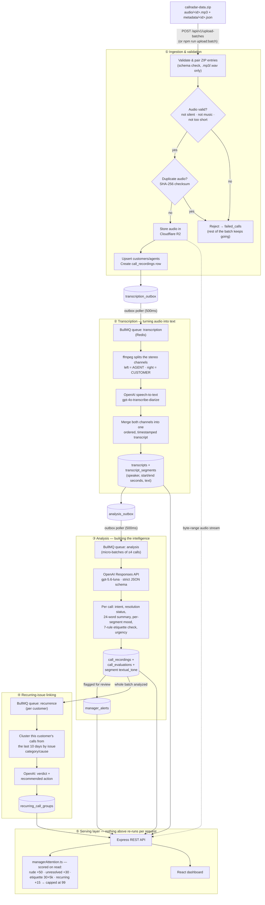

# CareSense — Backend

CareSense turns raw call-centre recordings into a call-centre analyst that never sleeps: it transcribes every call, works out what the customer wanted and whether they got it, tracks the moment a call turned bad, and tells a manager exactly which 5 calls out of 300 deserve their attention today — with the timestamp and words that justify every claim.

This repository is the backend: the ingestion pipeline, the transcription and analysis workers, the scoring engine, and the REST API. The dashboard that sits on top of it lives in the sibling [`careSense-dashboard`](https://github.com/kiranV-web/caresense-dashbord) repository.

## Tech stack

| Layer | Technology |
|---|---|
| API server | Node.js, Express 5, TypeScript |
| Background workers | BullMQ (transcription / analysis / recurrence queues), same codebase as the API, run as a separate process |
| Queue broker | Redis 7 |
| Database | PostgreSQL 16 |
| Object storage | Cloudflare R2 (S3-compatible) — audio files only |
| AI — speech-to-text | OpenAI `audio.transcriptions.create`, model `gpt-4o-transcribe-diarize` |
| AI — call analysis, recurrence detection, chat agent, coaching insights | OpenAI Responses API, model `gpt-5.6-luna`, strict JSON-schema structured output |
| Containers | Docker, multi-stage builds |
| Deployment | Single DigitalOcean Droplet, `docker compose`, Nginx (in the dashboard container) reverse-proxying `/api` to this service |

## How a call becomes a manager's insight



Nothing is re-computed on request: transcription, analysis, and recurrence all run exactly once per call and are cached in Postgres. The only thing computed live, on every request, is the manager-attention score — cheap arithmetic over already-analyzed data, so it's always exactly consistent with the latest data and never needs a background recompute job.

## What this covers, against the brief

**Required**
- ✅ Audio → speaker-attributed, timestamped transcript (stage ② above) — no pre-supplied transcripts are used.
- ✅ Per customer: every customer, by their caller ID, with full call history — recording + transcript for every call (`GET /api/v1/customers`, `/api/v1/customers/:id`).
- ✅ Per call: intent (`customer_problem`), mood and where it shifted (per-segment `textual_tone`, timestamped), resolution status, a summary (24 words, under the 40-word cap) — all on `GET /api/v1/calls/:id`.
- ✅ Ranked "needs a manager's attention today" (`GET /api/v1/calls-grouped?status_filter=attention`, `GET /api/v1/manager-attention/summary`) — see [Scoring](#the-manager-attention-score) below.
- ✅ Trending issues (`GET /api/v1/recurring-groups/:id`, recurrence stage ④).
- ✅ Per-agent view — call volumes, handle times, outcomes (`GET /api/v1/dashboard/team`, `GET /api/v1/agents/:id/calls`).
- ✅ Every judgment cites the moment that justifies it: segment-level `textual_tone` is timestamped, etiquette rule verdicts come with quoted transcript evidence, `customer_problem.evidence` is a transcript excerpt.

**Beyond the brief**
- Call-volume and issue trends across the whole dataset, not just per customer.
- An AI coaching insight that reads team-wide etiquette performance and tells a manager what to work on next (`GET /api/v1/dashboard/coaching-insight`).
- A per-agent etiquette heatmap.
- A 7-rule etiquette contract every agent is checked against on every call (see below).
- A chat agent (`POST /api/v1/chat/messages`) — a manager can ask a question in plain English and get an answer sourced from ~20 purpose-built SQL functions over the real data, not a general-purpose free-text model.
- Uploads survive a page refresh: the upload endpoint returns as soon as the ZIP is fully received; every later stage runs server-side in the queue regardless of whether the browser tab stays open, and progress is re-readable at any time from `GET /api/v1/upload-batches/:batchId`.

## The etiquette contract

Every call is checked against the same seven rules, each with a pass/fail verdict and quoted evidence:

`Greeting` · `Introduction` · `Empathy` (only when the situation calls for it — e.g. always applicable for a lost/stolen card, not applicable for a routine balance check) · `Offered help` · `Clear guidance` · `Thanked customer` · `Closing`

Results are stored in `call_evaluations`, one row per call.

## The manager-attention score

Score is computed live (`src/services/managerAttention.ts`), never stored, as the sum of every factor that applies to a call:

| Factor | Points |
|---|---|
| Rude call | +50 |
| Unresolved (or escalated) | +30 |
| Etiquette rule(s) missed | +30, then +5 per additional rule failed |
| Recurring issue | +15 |

The total is capped at **99** — a call scoring 90+ is `Critical` and lands at the top of the queue for direct manager review. Bands below that: `High` (75+), `Medium` (60+), `Elevated review` (45+), `Quality review` (below that). Every score comes with its full factor breakdown so a manager can see exactly why a call landed where it did — this is surfaced in the dashboard as a hover tooltip on the call-detail page.

## Data model (PostgreSQL)

| Table | Stores |
|---|---|
| `upload_batches` | One row per ZIP upload; processing state and counters |
| `customers`, `agents` | Identity, keyed by the caller/agent ID present in the source data |
| `call_recordings` | The central call row — storage location, transcription/analysis status, resolution, issue classification, `customer_problem`, urgency |
| `failed_calls` | Rejected ZIP entries with a reason (`SIZE_EXCEEDED`, `UNSUPPORTED_FORMAT`, `DUPLICATE_CALL`, `SILENT_AUDIO`, `MUSIC_DETECTED`, `AUDIO_TOO_SHORT`, `INVALID_AUDIO`, …) |
| `transcripts`, `transcript_segments` | Full transcript text, and one row per speaker turn with `start_seconds`/`end_seconds` and `textual_tone` |
| `call_evaluations` | The seven etiquette rule verdicts |
| `manager_alerts` | The attention-queue entry for a flagged call |
| `recurring_call_groups`, `recurring_call_members` | AI-grouped clusters of a customer's repeat calls about the same issue |
| `transcription_outbox`, `analysis_outbox` | Transactional outbox rows guaranteeing every call reaches the next stage exactly once, even across a restart |
| `application_settings` | Runtime-tunable settings — recurrence lookback window (10 days by default), ideal call duration, enabled etiquette rules |

## Validation on the way in

- Only `.mp3` and `.wav` audio is accepted; anything else is rejected per-file without failing the rest of the batch.
- Every audio file is screened before it's queued for transcription: **silent recordings**, **music-only files**, and **corrupt/invalid audio** are all detected and rejected (`failed_calls.failure_reason`), so garbage never reaches the (paid) transcription step.
- Duplicate audio is detected by content (SHA-256 checksum), not filename — re-uploading the same recording under a new name is still caught.
- There's no hard cap on ZIP size, but batches of roughly 50 calls at a time keep processing time and OpenAI rate limits comfortable.

## Known data notes

- The 1,441-call dataset provided didn't naturally contain many recurring-issue or rude-call examples to demonstrate those features against. A supplementary test batch built specifically to exercise recurring-issue grouping and rude-call flagging is available at:
  `https://pub-0ca6da575fa54913ac646f0806a77d62.r2.dev/test-batches/recurring-callz-f0293c18c4ea.zip`
  — upload it the same way as the main dataset to see both features in action.
- In the source data, an agent's speaker ID is sometimes reused across different display names. Rather than assume one name per ID, the system keeps every name ever seen for an agent identity (`agents.speaker_ids_seen`) so agent-level stats stay correctly attributed.

## Running it from scratch

### Local development

```bash
cp .env.example .env        # fill in OPENAI_API_KEY, Cloudflare R2 credentials
docker compose up -d        # Postgres (port 5433) + Redis (port 6380)
npm install
npm run migrate

npm run dev                 # terminal 1 — API on :1000 (PORT in .env.example)
npm run worker              # terminal 2 — BullMQ workers
```

Ingest the dataset:

```bash
npm run upload:batch -- ./callradar-data.zip http://localhost:1000
curl http://localhost:1000/api/v1/upload-batches/<batchId>          # poll status
curl http://localhost:1000/api/v1/upload-batches/<batchId>/events   # or subscribe to SSE progress
```

Then start the dashboard (see [`careSense-dashboard`](https://github.com/kiranV-web/caresense-dashbord)) — its dev server proxies to `http://localhost:1000` by default.

### Full stack in Docker (one Droplet, one command)

From the parent directory containing both `careSense-server` and `careSense-dashboard` as sibling checkouts, with the root-level `docker-compose.yml`:

```bash
cp .env.example .env        # root-level env: Postgres/Redis passwords, OPENAI_API_KEY, R2 credentials, VITE_* build args
docker compose up -d --build
```

This builds and starts, in order: `postgres` → `redis` → `migrate` (runs the SQL migrations, then exits) → `api` + `worker` → `dashboard` (Nginx, serves the built React app and reverse-proxies `/api/*` to the `api` container). Only port 80 is published to the host; Postgres, Redis, and the API are reachable only from other containers on the compose network.

## API reference

| Endpoint | Purpose |
|---|---|
| `POST /api/v1/upload-batches` | Upload one ZIP (`multipart/form-data`, field `archive`) — returns `202` immediately |
| `GET /api/v1/upload-batches/:id` | Batch state and per-stage counters |
| `GET /api/v1/upload-batches/:id/events` | Server-Sent Events stream of live progress |
| `GET /api/v1/upload-batches/:id/staging-errors` / `/failed-calls` | Rejected files and why |
| `GET /api/v1/calls` | Paginated, filterable call list |
| `GET /api/v1/calls-grouped?status_filter=attention` | The ranked "needs manager attention" queue |
| `GET /api/v1/calls/:id` | Full call detail — transcript, segments, tones, rules, resolution, attention score |
| `GET /api/v1/calls/:id/audio` | Audio playback, proxied from R2 with HTTP byte-range support |
| `GET /api/v1/manager-attention/summary` | Attention-queue totals by reason, for the dashboard's summary tile |
| `GET /api/v1/customers` / `GET /api/v1/customers/:id` | Customer list / one customer's full call history |
| `GET /api/v1/recurring-groups/:id` | A recurring-issue cluster's summary, verdict, and call timeline |
| `GET /api/v1/dashboard/home` / `/team` / `/agent-quality` / `/coaching-insight` | KPI, team, per-agent-quality, and AI coaching views |
| `GET /api/v1/agents/:id/calls` | One agent's calls and etiquette results |
| `GET /api/v1/manager-alerts` / `PATCH /api/v1/manager-alerts/:id` | Attention-queue entries, and marking one reviewed |
| `POST /api/v1/chat/messages` | The chat agent |
| `GET /health` / `GET /ready` | Liveness / readiness (Postgres, Redis, R2) |

## Resetting local data

```bash
npm run flush:all -- --yes       # wipe Postgres data, Redis queues, and R2 recordings
npm run truncate:data -- --yes   # wipe only operational Postgres rows, keep settings/migrations
npm run flush:queues -- --yes    # wipe only Redis/BullMQ state
```

Disabled in production; stop the API and worker first so nothing writes mid-reset.
